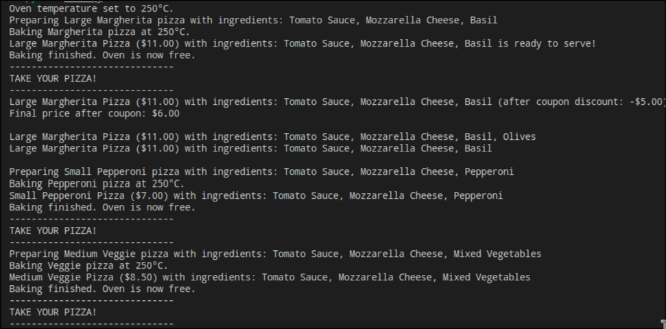

# Creational Design Patterns


## Author: Tofan Liviu FAF-223

----

## Objectives:

* Get familiar with the Creational DPs;
* Choose a specific domain;
* Implement at least 3 CDPs for the specific domain;


## Used Design Patterns:

* **Singleton Pattern**  
  Ensures a class has only one instance and provides a global access point to that instance. In this project, the `OvenManager` uses the Singleton pattern to ensure that only one oven instance controls the temperature and baking operations, maintaining consistent settings across all pizzas.

* **Factory Method Pattern**  
  Provides an interface for creating objects in a superclass but allows subclasses to alter the type of objects that will be created. Here, the `PizzaFactory` uses the Factory Method to create different types of pizzas based on the requested `PizzaType`, making it easy to add new pizza types without altering existing code.

* **Prototype Pattern**  
  Allows creating new objects by copying existing ones instead of creating new instances from scratch. This pattern is used to clone a pizza, enabling the creation of modified versions without altering the original pizza instance—useful when a customer wants a similar pizza with slight adjustments.

* **Decorator Pattern (Structural)**  
  Allows adding responsibilities to an object dynamically. In this project, the `CouponDecorator` is used to apply a discount on a pizza, adjusting the price without changing the pizza's fundamental structure. This makes adding temporary modifications (like discounts) straightforward and flexible.


## Implementation

In this project, I implemented several design patterns to manage different aspects of creating, modifying, and handling pizzas. The Singleton pattern ensures there’s only one oven in use at a time, while the Factory Method allows for easy creation of various pizza types. The Prototype pattern helps clone a pizza so I can customize it without affecting the original, and the Decorator pattern applies a discount to the pizza price dynamically. These patterns made the code flexible, reusable, and easy to extend.

### Code Snippets

Here are some key parts from the code:

1. **Singleton Pattern** for the Oven Manager to keep only one oven instance:
    ```python
    class OvenManager:
        _instance = None

        @staticmethod
        def get_instance():
            if OvenManager._instance is None:
                OvenManager._instance = OvenManager()
            return OvenManager._instance

        def set_temperature(self, temp):
            print(f"Oven temperature set to {temp}°C.")

        ...
    ```
   * I used the Singleton pattern to make sure only one oven exists throughout the app. Since there's just one oven instance, I can easily manage the temperature and baking process without risking multiple ovens conflicting. This pattern simplifies the code by making it easy to access and control a single oven instance.

2. **Factory Method Pattern** for creating different types of pizzas:
    ```python
    class PizzaType(Enum):
        MARGHERITA = "Margherita"
        PEPPERONI = "Pepperoni"
        VEGGIE = "Veggie"

    class PizzaFactory:
        @staticmethod
        def create_pizza(pizza_type: PizzaType, size="medium"):
            if pizza_type == PizzaType.MARGHERITA:
                return MargheritaPizza(size)
            elif pizza_type == PizzaType.PEPPERONI:
                return PepperoniPizza(size)
            elif pizza_type == PizzaType.VEGGIE:
                return VeggiePizza(size)
            else:
                raise ValueError(f"Unknown pizza type: {pizza_type}")
    ```
   * The Factory Method pattern lets me create any type of pizza by just specifying its type. With this pattern, adding new pizza types to the system is easy without changing the creation logic everywhere in the code. It keeps my code organized and lets me extend pizza types flexibly as needed.

3. **Prototype Pattern** to clone an existing pizza:
    ```python
    class Pizza(ABC):
        def __init__(self, name, ingredients, size="medium"):
            self.name = name
            self.ingredients = ingredients
            self.size = size
            self.price = self.calculate_price()

        @abstractmethod
        def calculate_price(self):
            pass

        def prepare(self):
            print(f"Preparing {self.size.capitalize()} {self.name} pizza with ingredients:", ', '.join(self.ingredients))

        def clone(self):
            cloned_pizza = copy.deepcopy(self)
            cloned_pizza.price = cloned_pizza.calculate_price()
            cloned_pizza.ingredients = self.ingredients[:]
            return cloned_pizza
        
        def __str__(self):
            return f"{self.size.capitalize()} {self.name} Pizza (${self.price:.2f}) with ingredients: {', '.join(self.ingredients)}"
    ```
   * I used the Prototype pattern so I can create a copy of an existing pizza and customize it without affecting the original. This pattern is convenient because I can clone a pizza, modify the clone, and add new ingredients or change its size without needing to start from scratch. It also makes my code reusable, as I can quickly make copies of pizzas and adjust them to customer requests.

4. **Decorator Pattern** to apply a coupon discount on a pizza:
    ```python
    class CouponDecorator(Pizza):
        def __init__(self, pizza, discount=5.00):
            self.pizza = pizza
            self.discount = discount
            super().__init__(self.pizza.name, self.pizza.ingredients, self.pizza.size)

        def calculate_price(self):
            discounted_price = self.pizza.calculate_price() - self.discount
            if discounted_price < 0:
                return 0
            return discounted_price

        def prepare(self):
            self.pizza.prepare() 

        def __str__(self):
            return f"{self.pizza} (after coupon discount: -${self.discount:.2f})"
    ```
   * The Decorator pattern allowed me to add extra features, like applying a discount, to a pizza without changing its core class. This is helpful for scenarios where I might want to add additional options or deals for the customer. By using this pattern, I can modify the price after applying a discount while keeping the original pizza’s properties intact and reusable.


These patterns allowed me to build a pizza-making system that’s modular, flexible, and can be extended easily with new features or types of pizzas.

<p align="center">
  <br>
  <strong>Figure 1. Program Output</strong>
</p>
In this image, you can see the output of the pizza preparation system in action. It shows various steps, including setting the oven temperature, creating and baking different pizzas like Margherita, Pepperoni, and Veggie, and applying a discount coupon. After preparing a large Margherita pizza, the coupon discount is applied, showing a reduced final price. The code also demonstrates cloning the Margherita pizza using the Prototype pattern to create a modified copy with added olives, and finally, two other pizzas (small Pepperoni and medium Veggie) are prepared and baked in the oven.


## Conclusion

Now that I’ve learned about creational design patterns, I have a solid understanding of how these patterns help create code that is more readable, logical, and easy to modify. By implementing patterns like Singleton, Factory Method, Prototype, and Decorator in my project, I’ve seen how they provide structured ways to handle object creation, enhance flexibility, and make future changes straightforward.

Creational patterns are essential because they allow us to focus on the “how” and “why” behind object creation, allowing the code to use memory efficiently and reducing unnecessary complexities. With patterns like Factory and Prototype, I can control the creation and reuse of instances without tightly coupling them to other parts of the system. This helps in writing code that can grow with new requirements while keeping the memory usage under control, supporting a clean, organized, and scalable project structure.

## Bibliography

- [Refactoring Guru: Factory Method](https://refactoring.guru/design-patterns/factory-method)  
- [GeeksforGeeks: Python Design Patterns](https://www.geeksforgeeks.org/python-design-patterns/)
