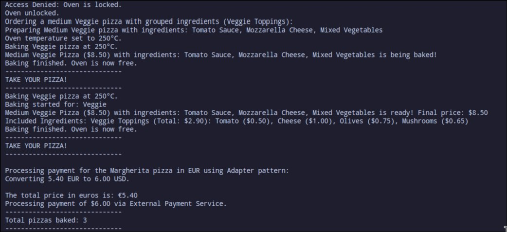

# Laboratory Work #2: Structural Design Patterns

## Author: Tofan Liviu, FAF-223

---

## Objectives

* Understand and implement Structural Design Patterns.
* Apply at least 3 structural design patterns to a chosen domain.
* Demonstrate the practical application and benefits of structural patterns in software development.

---

## Used Design Patterns

### 1. **Facade Pattern**
The Facade pattern provides a simplified interface to a larger body of code, helping to hide complexities and make the codebase easier to interact with. In this project, the `OrderFacade` class acts as a single entry point for ordering and customizing pizzas, hidding processes such as calculating prices, applying discounts, and preparing pizzas.

**Code Snippet:**
```python
class OrderFacade:
    def __init__(self):
        self.oven = OvenManager()
        self.factory = PizzaFactory()

    def order_pizza(self, pizza_type, size, discount=None):
        pizza = self.factory.create_pizza(pizza_type, size=size)
        pizza.prepare()

        if discount:
            pizza = CouponDecorator(pizza, discount=discount)
        
        self.oven.set_temperature(250)
        self.oven.start_baking(pizza.name)
        print(f"{pizza} is being baked!")
        self.oven.stop_baking()
        self.oven.take_your_pizza()
        
        final_price = pizza.calculate_price()
        return pizza, final_price
```
* This pattern helps to change code structure without changing the logic for ordering, making it easier for the client code (`main.py`) to order pizzas without needing to understand the intricate details of preparation and pricing.

### 2. **Adapter Pattern**
The Adapter pattern allows for incompatible interfaces to work together. In this project, the `PaymentAdapter` class enables the internal system to interact with an external payment service that uses a different currency conversion logic.

**Code Snippet:**
```python
class PaymentAdapter(PaymentProcessor):
    def __init__(self, external_service, conversion_rate=1.0):
        self.external_service = external_service
        self.conversion_rate = conversion_rate

    def convert_to_dollars(self, amount_in_euros):
        if amount_in_euros <= 0:
            raise ValueError("Amount must be greater than zero.")
        return amount_in_euros * self.conversion_rate


    def process_payment(self, amount, currency="USD"):
        if currency == "EUR":
            amount_in_dollars = self.convert_to_dollars(amount)
            print(f"Converting {amount:.2f} EUR to {amount_in_dollars:.2f} USD.")
            print(f"\nThe total price in euros is: €{amount:.2f}")
        else:
            amount_in_dollars = amount

        self.external_service.make_payment(amount_in_dollars)
```
* The `PaymentAdapter` facilitates payment in different currencies by converting the price based on a specified conversion rate and interacting with `ExternalPaymentService`.

### 3. **Composite Pattern**
The Composite pattern allows treating individual objects and compositions of objects uniformly. In this project, it was used to manage pizza ingredients. The `IngredientGroup` class can group ingredients together and interact with them as a single entity.

**Code Snippet:**
```python
class IngredientGroup(IngredientComponent):
    def __init__(self, name):
        self.name = name
        self.ingredients = []

    def add(self, ingredient):
        self.ingredients.append(ingredient)

    def remove(self, ingredient):
        self.ingredients.remove(ingredient)

    ...

    def __str__(self):
        ingredients_str = ", ".join(str(ingredient) for ingredient in self.ingredients)
        return f"{self.name} (Total: ${self.get_cost():.2f}): {ingredients_str}"
```
* The `IngredientGroup` enables grouping multiple ingredients as one component, simplifying ingredient management for pizzas with complex toppings.

### 4. **Proxy Pattern**
The Proxy pattern controls access to an object by creating a surrogate or placeholder. Here, the `OvenProxy` class is used to control access to the oven, adding safety measures like locking and unlocking to prevent unauthorized baking.

**Code Snippet:**
```python
class OvenProxy:
    def __init__(self):
        self.oven_manager = OvenManager()
        self.pizzas_baked = 0
        self.is_locked = False

    ...

    def lock_oven(self):
        self.is_locked = True
        print("Oven locked.")

    def unlock_oven(self):
        self.is_locked = False
        print("Oven unlocked.")

    def get_baking_count(self):
        return self.pizzas_baked
```
* The `OvenProxy` ensures the oven can only be used when not locked, adding an extra layer of safety and control over the baking process.

---

## Implementation Overview

In this laboratory work, I implemented the **Facade**, **Adapter**, **Composite**, and **Proxy** patterns to create a robust pizza ordering system. Each pattern contributed to making the codebase more modular, easier to maintain, and more aligned with real-world complexities. By applying these structural patterns, I learned how they enhance the flexibility and scalability of software projects. Now, since my project has better structure and logic it can be sold to Andy's Pizza :) .

<p align="center">
  <br>
  <strong>Figure 1. Program Output</strong>
</p>
This output illustrates a part of the practical implementation of the Structural Patterns.

- **Proxy**: Controls oven access (locked/unlocked).
- **Facade**: Simplifies pizza ordering and preparation.
- **Composite**: Manages grouped ingredients and calculates total cost.
- **Adapter**: Converts currency and processes payments seamlessly.

These implementations demonstrate effective design pattern usage, making the system well-structured and maintainable.

---

## Results

### Key Benefits of Structural Patterns:
* **Simplified Interface**: The **Facade pattern** provided a easy way to interact with the system, making the user experience straightforward.
* **Compatibility**: The **Adapter pattern** allowed integration with an external payment system without changing the existing code.
* **Hierarchical Compositions**: The **Composite pattern** facilitated treating individual ingredients and groups of ingredients uniformly.
* **Controlled Access**: The **Proxy pattern** added security and control over the oven, ensuring safe and consistent baking.

---

## Conclusion

Structural design patterns play a crucial role in creating well-organized, maintainable, and scalable code. By implementing these patterns, I gained practical experience in simplifying complex systems, improving flexibility, and enhancing overall code maintainability. This project reinforced the importance of structural patterns in real-world applications and showcased how they contribute to better project design.

---

## Bibliography

- [Refactoring Guru: Structural Design Patterns](https://refactoring.guru/design-patterns/structural)
- [GeeksforGeeks: Design Patterns in Python](https://www.geeksforgeeks.org/design-patterns-python/)
- [Python Patterns: A Guide to Implementing Design Patterns in Python](https://python-patterns.guide/)