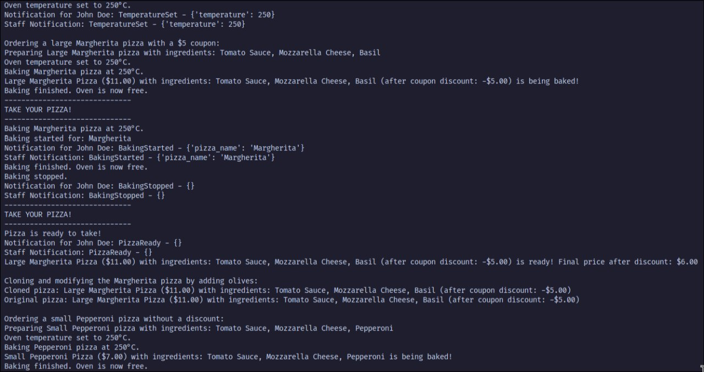

# Laboratory Work #3: Behavioral Design Patterns

## Author: Tofan Liviu, FAF-223

---

## Topic
Implementation of Behavioral Design Patterns in a Pizza Ordering System.

---

## Objectives

- The implemented design pattern should help to perform the tasks involved in your system.
- The behavioral DPs can be integrated into you functionalities alongside the structural ones.
- There should only be one client for the whole system.
---

## Introduction
Behavioral design patterns focus on the interaction and responsibility of objects. These patterns help manage complex workflows and improve communication between objects. In this laboratory work, I extended my pizza ordering system by implementing two behavioral design patterns:

- **Command Pattern**: To encapsulate and execute user actions such as preparing and baking pizzas.
- **Observer Pattern**: To enable dynamic notifications for events such as order status updates.

---

## Implementation & Explanation

### 1. Command Pattern

The Command Pattern encapsulates user actions into objects, enabling them to be parameterized, queued, or logged. In this project, commands are used to manage pizza preparation and baking operations.

#### Implementation

**File:** `commands/command.py`

```python
class Command(ABC):
    @abstractmethod
    def execute(self):
        pass
```
This `Command` interface is implemented by concrete commands such as `BakeCommand`, `StopBakeCommand`, and `PaymentCommand`, encapsulating their specific actions and allowing flexible execution through a common interface.

**Scope:** The Command Pattern simplifies task delegation and allows for easy extension by adding new commands without modifying existing code.

---

### 2. Observer Pattern

The Observer Pattern allows an object (subject) to notify a list of dependent objects (observers) about state changes dynamically. Here, it is used to update the client about the status of their pizza order.

#### Implementation

**File:** `observer/observer.py`

```python
class Observer(ABC):
    @abstractmethod
    def update(self, event: str, data: dict):
        pass
```
This `Observer` interface is implemented by `CustomerObserver`, `StaffObserver` to notify customers and staff members.

**File:** `observer/subject.py`

```python
class Subject(ABC):
    @abstractmethod
    def subscribe(self, observer):
        pass

    @abstractmethod
    def unsubscribe(self, observer):
        pass

    @abstractmethod
    def notify(self, event: str, data: dict):
        pass
```
Defines methods for subscribing, unsubscribing, and notifying observers. It is implemenetd in EventManager.

**Scope:** The Observer Pattern improves real-time communication by notifying clients about order status changes dynamically.

---

## Results

### Key Features of Behavioral Patterns:

- **Command Pattern:**
  - Encapsulates user actions, making the system extendable and maintainable.
  - Simplifies task management and delegation.

- **Observer Pattern:**
  - Enhances real-time communication by dynamically notifying clients of status updates.
  - Decouples the subject and observer, improving system modularity.


<p align="center">
  <br>
  <strong>Figure 1. Program Output</strong>
</p>
This output illustrates a part of the practical implementation of the Behavioral Patterns.
---

## Conclusions

By integrating the Command and Observer patterns into the pizza ordering system, the project’s functionality and maintainability have been improved. The Command Pattern allows for seamless task delegation, while the Observer Pattern ensures dynamic client notifications. Both patterns enhance the scalability of the system, making it easier to extend and adapt to new requirements.


## Bibliography

- [Refactoring Guru: Structural Design Patterns](https://refactoring.guru/design-patterns/behavioral-patterns)